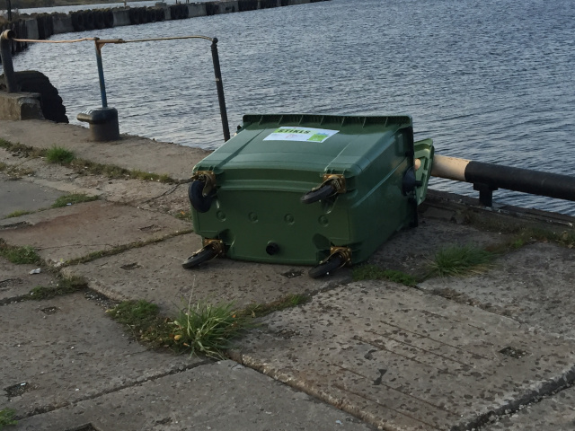

<!------>

## Projects

[3D Graphics package](https://github.com/racenis/tram-sdk)
- Allows creation of 3D graphics applications
- Useful for video games, data visualizations, simulations, digital twins, virtual reality
- Optimized for low-end hardware
- Mostly implemented in *C++*, includes some *Python* scripts
- OpenGL, DirectX and software rendering backends
- Targets Windows, Linux and Web

[Online strategy game](https://github.com/racenis/kakis)
- Playable in a web browser
- Implemented in *PHP* using *MVC* architecture

[Image processing CLI utilities](https://github.com/racenis/DatZ5023)
- Applies various image filters (Gaussian blur, Fourier convolution, wavelet transforms, etc.)
- Implemented using only the *C* language and C standard library, no external tools

[Employee work schedule optimizer](https://github.com/racenis/DatZ6103--MAZAIS-un-LIELAIS-praktiskais-darbs)
- Optimizes work schedules for a company's employees
- Accessed through a SPA application web interface
- Includes a *REST API*
- Implemented in the *Erlang* language, leveraging its concurrency

[Multi-agent system simulation framework](https://github.com/racenis/daudzagenti)
- Allows defining agents, interactions between them
- Includes a LISP-like scripting language
- Implemented in *C*, for speed and easy integration with other languages
- Also includes a simulation manager app written in *Object Pascal*

[Smart contract](https://github.com/racenis/blokkedes)
- Allows users to collaboratively play the game DOOM.
- Web interface for the contract created using *Node.js*
- Contract targets the Ethereum blockhain, implemented in Solidity

[Block stacking Android app](https://github.com/racenis/block-falling)
- It's like Tetris, but in 3D
- Implemented in *Kotlin*, uses *OpenGL ES* API for graphics

[Web page with a fancy design](https://github.com/racenis/timekla-dizains)
- Implemented in *HTML* and *CSS*
- Designed to be usable both on desktop and on mobile

[Level editor for my 3D graphics package](https://github.com/racenis/tram-world-editor)
- Useful for creating virtual spaces, video game levels, etc.
- Implemented in *C++* using *wxWidgets* GUI framework

[Level editor prototype](https://github.com/racenis/tram-editor)
- Prototype for my level editor
- Implemented in *Kotlin* using the *Java Swing* GUI library

[Script interpeter](https://github.com/racenis/ligmascript)
- Interpreter for a stack-based language
- Contains bytecode compiler and bytecode interpeter
- Implemented in *C++*
